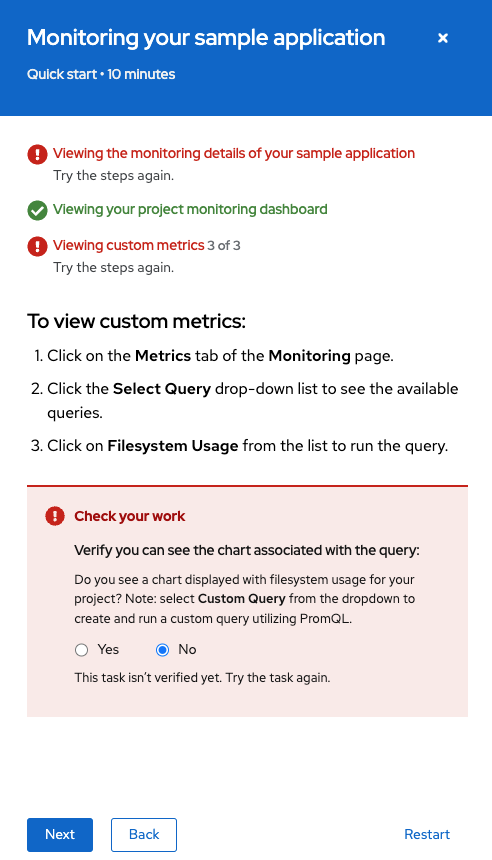
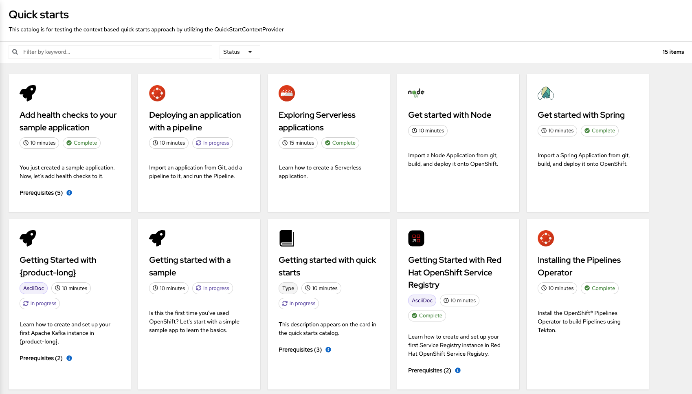
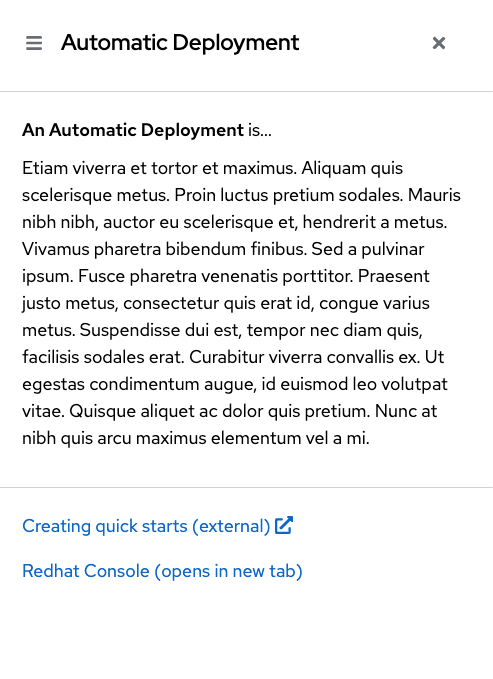

---
# Sidenav top-level section
# should be the same for all markdown files for each extension
section: extensions
# Sidenav secondary level section
# should be the same for all markdown files for each extension
id: Quick Starts
# Tab
source: about
---
# About
The **@patternfly/quickstarts** extension is made up of two parts: `Quick starts` and `In App Documentation` product documentation tools.

## Full live demo application
A live demo of **Quick starts and In App Documentation** can be found [here](https://quickstarts.netlify.app/), or view the [demo code](https://github.com/patternfly/patternfly-quickstarts/tree/main/packages/dev).

A few key concepts are outlined below.

## Quick starts
A `Quick start` is a set of step-by-step instructions and tasks presented in a side panel embedded in a product’s UI. Quick starts can help users get started with a product, and they often provide guidance around installation and setup.

Each task in a quick start has multiple steps, and each quick start has multiple tasks. The outcome of the quick start includes the artifacts or state needed to successfully use the product, specific features, or add-ons.



For more detailed design guidelines and visuals see [here.](/extensions/quick-starts/design-guidelines#quickstarts)

### Quick start format

#### For developers
A detailed breakdown of the Quick start format in code can be seen [here](https://github.com/patternfly/patternfly-quickstarts/blob/main/packages/module/src/utils/quick-start-types.ts).

Quickly preview a [basic example](/extensions/quick-starts/Basic-Quick-Starts), and remember there is a [live demo](https://quickstarts.netlify.app/) with [full demo code](https://github.com/patternfly/patternfly-quickstarts/tree/main/packages/dev).

#### For content authors
Quick starts can be written in `yaml` with markdown support, `asciidoc`, or just `json`. For examples of each of these formats see [here](https://github.com/patternfly/patternfly-quickstarts/tree/main/packages/dev/src/quickstarts-data)

### Opening and closing the side panel

#### Custom handler
Open the side panel by calling the `setActiveQuickStart` or `setActiveQuickstartID` methods. These methods are provided by the `QuickStartContext` and can be accessed in your React components:
```typescript
const { setActiveQuickStart } = React.useContext<QuickStartContextValues>(
    QuickStartContext,
  );
```

#### Quick start catalog
By providing a set of quick starts to the `QuickStartContainer`, a full page catalog view will be generated. Clicking on a catalog card will open its respective `Quick start` in the side panel. 



## In App Documentation
In App Documentation is used to provide definitions for a set of topics relevant to your product. A single unit of In App Documentation can be called a `HelpTopic`, which is also the name used in code. `HelpTopic`'s essential sections are a **content** section that contains a definition of the term or topic, and an optional list of **links** to provide the user with other relevant information.

`HelpTopics` are displayed in a side panel just like `Quick starts`:



### Help Topic format

#### For developers
A detailed breakdown of the `HelpTopic` format in code can be seen [here](https://github.com/patternfly/patternfly-quickstarts/blob/main/packages/module/src/utils/help-topic-types.ts).

Quickly preview a [basic example](/extensions/quick-starts/In-App-Documentation), and remember there is a [live demo](https://quickstarts.netlify.app/in-context-help) with [full demo code](https://github.com/patternfly/patternfly-quickstarts/tree/main/packages/dev).

#### For content authors
HelpTopics are written in `yaml` with markdown support. An example can be seen [here](https://github.com/patternfly/patternfly-quickstarts/blob/main/packages/dev/src/quickstarts-data/yaml/in-context-help/example-topics.yaml)

### Opening and closing the side panel
Open the side panel by calling `setActiveHelpTopicByName` (available from `HelpTopicContext`) with a `HelpTopic`'s name value.

```typescript
const { setActiveHelpTopicByName } = React.useContext<HelpTopicContextValues>(HelpTopicContext);
```

Close it by calling `setActiveHelpTopicByName` with an empty string. There is no prebuilt `HelpTopic` catalog. simply attach a handler with `setActiveHelpTopicByName` to the appropriate DOM element. See the [basic example](/extensions/quick-starts/In-App-Documentation), or [live demo code](https://github.com/patternfly/patternfly-quickstarts/tree/main/packages/dev) for more details.
